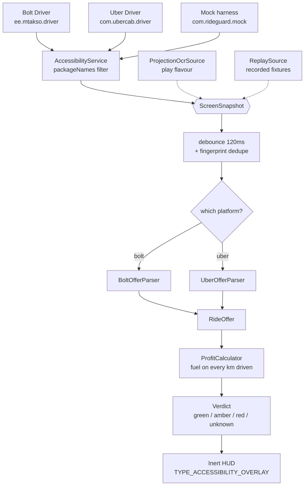

# RideGuard

Reads the ride offer on screen in **Bolt Driver** and **Uber Driver**, works out
what the ride *actually* pays per kilometre after fuel, and shows it in a small
floating window while the driver still has time to decide.

Everything happens on the phone. Nothing is sent anywhere.

---

## Why it exists

Both platforms show a fare. Neither shows:

- the fuel burned driving to the passenger (the **deadhead** leg),
- what the fare works out to **per kilometre actually driven**,
- what the ride works out to **per hour**.

A driver gets roughly **10–15 seconds** to accept. Nobody does that arithmetic
in ten seconds, so the bad offers that *look* fine get accepted all shift.

The number that catches them is the **deadhead ratio** — pickup km ÷ trip km.
A real example, straight off a Bolt card: **11,62 lei**, 2.8 km to collect,
3 km carrying. Half the driving is unpaid, it works out to 42 lei/hour before
anything goes wrong, and none of that is visible under time pressure.

---

## Repository layout

```
co/
├── android/     Kotlin. The real app. Reads the screen, draws the HUD.
├── mock/        Expo. Fake Bolt/Uber offer screens for testing without real rides.
├── ios/         Swift. Domain parity + a live HUD via ReplayKit and Picture-in-Picture.
├── updates/     latest.json — the manifest every installed app polls.
├── release.sh   Bump, build, sign, publish, point the manifest at it.
└── docs/
```

---

## Status

| Piece | State |
|---|---|
| `:domain` — parsing, economics, verdicts | **42 JVM tests passing** |
| `:capture` — accessibility + OCR readers | compiles |
| `:overlay` — floating HUD | compiles |
| `:data` — settings | compiles |
| `:app` — onboarding, settings, services | **both flavour APKs build** |
| `mock` — Expo harness | typechecks clean, contract-tested against the parser |
| `ios` | code complete, **unbuilt and untested** — see caveat below |

```bash
cd android
./gradlew :domain:test              # 42 tests, ~10s, no device needed
./gradlew :app:assembleSideloadDebug
```

---

## Architecture



Three readers, one `ScreenSource` interface, and nothing downstream can tell
them apart. `:domain` has **zero Android dependencies**, which is what makes
the 42 tests run on the JVM in seconds with no emulator.

---

## The five decisions that matter

**1. Native Kotlin, not Flutter or React Native.** Every capability here —
`AccessibilityService`, `MediaProjection`, `WindowManager` overlays — is a
native Android API with no cross-platform equivalent. A bridge would add a
serialization boundary and a second runtime to a problem with zero
cross-platform surface, and community overlay plugins spin up an entire second
engine for a HUD that must stay featherweight.

**2. `packageNames` in the accessibility config.** Restricting the service to
three packages means it is completely dormant — no wakeups, no tree walks, no
battery cost — outside Bolt and Uber. This one XML attribute is worth more than
any optimisation in the code.

**3. `TYPE_ACCESSIBILITY_OVERLAY`, not `TYPE_APPLICATION_OVERLAY`.** Adding the
window from inside the accessibility service means no "draw over other apps"
permission at all, **and** immunity to `Window.setHideOverlayWindows(true)` —
an API available since Android 12 that force-hides ordinary overlays. If either
driver app ever switches that on, an ordinary overlay just vanishes.

**4. The HUD cannot be touched, and is clamped out of the bottom 34% of the
screen.** Android silently discards touches arriving at a view with
`filterTouchesWhenObscured="true"` while another window overlaps it. Cover the
Accept button and the driver taps, nothing happens, the offer expires. The
window therefore sets `FLAG_NOT_TOUCHABLE` so every touch passes straight
through, *and* stays out of the Accept zone. Belt and braces, because the
failure costs a real ride.

**5. Cost is charged on the *full* distance.** Pickup plus trip, not just the
paid leg. That gap is where the money quietly disappears, and closing it is the
entire point.

---

## Two build flavours, one codebase

| | `sideload` | `play` |
|---|---|---|
| Reader | AccessibilityService | MediaProjection + ML Kit OCR |
| Speed | single-digit ms | 200–500 ms per pass |
| Battery | negligible when idle | real cost |
| Overlay permission | not needed | required |
| Suppressible by host app | no | yes |
| Play Store | would be rejected | fine |

Google Play requires accessibility services to genuinely serve users with
disabilities, enforced via a Permissions Declaration Form. A ride-profit
analyser does not qualify — every app in this category that ships on Play uses
OCR. The `ScreenSource` interface makes this a build-config swap, not a fork.

Use `sideload` for yourself and your friend.

---

## Getting it running

```bash
# 1. The app
cd android
./gradlew :app:installSideloadDebug

# 2. The test harness
cd ../mock
npm install
npx expo run:android
```

Then:

1. Open RideGuard → onboarding asks two things: **fuel type + consumption per
   100 km**, and **fuel price**. That is the whole setup. Targets start at
   sensible defaults and are editable later in Settings.
2. Enable **Settings → Accessibility → RideGuard offer reader**.
3. Grant the battery exemption (and the OEM autostart step it prompts for on
   Xiaomi / Huawei / Oppo / Vivo / Samsung — those kill background services
   regardless of what stock Android allows).
4. Open the mock, tap a preset, hit **Fire offer**.

Verify: HUD appears fast, numbers match, `Classic trap` reads red, `Single
distance` reads dimmed/UNKNOWN, taps land on the Accept button *through* the
HUD, and it does not flicker as the countdown ticks.

---

## Updating without a store

RideGuard is not in Google Play, so nothing in the OS will ever mention a new
build. It updates itself from GitHub instead:

```bash
./release.sh 1.1.0 "Bolt fares are read as net now."
```

That bumps the version, builds and signs the APK, uploads it as a GitHub
release, **confirms the asset is actually fetchable**, and only then publishes
`updates/latest.json`. Installed apps poll that file, compare version codes,
verify the SHA-256 of what they downloaded, and hand it to the system installer.
Nothing installs itself unasked.

The signing key is the load-bearing part: Android refuses to replace an app with
one signed by a different key, so the keystore lives at `~/.rideguard/` outside
the repo, and `release.sh` refuses to publish an APK whose certificate does not
match it. **Back that keystore up** — losing it makes every existing install
un-updatable.

Full detail, including the iOS `itms-services://` path and what it costs:
`docs/updates.md`.

---

## Build this next: record mode

Settings → Developer → **Record offers to disk**.

Run one real shift with it on. You come back with dozens of genuine Bolt and
Uber cards — surge, normal, short, long, and the malformed ones nobody would
think to invent — as JSON fixtures. From then on the parser is tuned on a
laptop against real data with instant feedback, instead of in a parked car at
2am waiting for a ride request.

That is why `ReplaySource` is a first-class `ScreenSource` and not a testing
afterthought.

---

## Honest caveats

**The parsers are heuristic and untuned.** No real screenshots existed when
this was built, so `BoltOfferParser` and `UberOfferParser` assemble offers from
reading order — headline fare in the largest type, deadhead leg above the paid
leg. That is how both cards are actually laid out, and it passes every mock
contract test, but it is the first thing to tighten once record mode has run.

**Gross-vs-net is settled for Romania, and was wrong before.** Both cards show
the driver's **net** take — Bolt prints `11,62 lei (NET, taxe incluse)`, Uber
prints `Câștig net (fără comisionul Uber)`. The app used to assume Bolt showed a
gross fare and skimmed 20% off it, which made every Bolt offer read 20% worse
than reality. Nothing crashed and no test failed; the numbers were simply,
quietly wrong. Two regression tests now pin both cards to figures transcribed
from real screenshots. If you take this to another market, verify it again
against a payout statement — this is the easiest thing in the app to be
confidently wrong about.

**iOS gets there by a different road, and it costs the driver two taps.** There
is still no accessibility-style screen reading and no `TYPE_APPLICATION_OVERLAY`
on iOS. What there is: a **ReplayKit broadcast extension** that receives frames
of the whole screen, and a **Picture-in-Picture window** — the only kind iOS
lets float over another app — to draw the verdict in. That combination gives a
genuine live HUD over Bolt and Uber.

The catch is that neither half can be started programmatically. The driver must
start the broadcast and start the HUD himself, every shift, and again after any
phone call that interrupts it. The app's onboarding is built around teaching
exactly that, because a driver who does not know it will see nothing and assume
the app is broken. Manual quick entry remains as the always-works fallback. See
`docs/ios-platform-limits.md`.

**Third-party tools are against both platforms' driver terms.** A read-only
advisory HUD is the low-risk end of that spectrum; auto-tapping Accept via
`performAction()` is the high-risk end, and is also what provokes the
anti-overlay countermeasures in the first place. This app deliberately only
reads.
