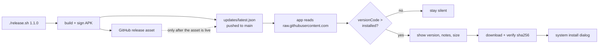

# Updating without a store

RideGuard is not in Google Play and not in the App Store, so nothing in the
operating system will ever tell a driver that a new build exists. This document
describes the mechanism that does.

## The shape of it



The manifest is published **after** the asset is confirmed fetchable. There is
therefore never a moment where a phone is told to download something that does
not exist yet.

## Why a plain JSON file and not the GitHub Releases API

The API is rate limited without auth, paginated, and its response shape belongs
to GitHub rather than to us. A single static file at a stable raw URL has none
of those problems, is CDN-cached, needs no token, and lets us carry fields the
API has no concept of — most importantly a SHA-256 of the artifact.

Cost: `raw.githubusercontent.com` caches for about five minutes, so a freshly
published release is not instantly visible. That is an acceptable trade for a
driver-facing app; it is not a chat client.

## The manifest

Lives at
`https://raw.githubusercontent.com/zigazaga4/rideguard/main/updates/latest.json`

```json
{
  "schemaVersion": 1,
  "publishedAt": "2026-08-20T17:00:00Z",
  "notes": "Bolt fares are read as net now.",
  "mandatory": false,
  "android": {
    "versionCode": 3,
    "versionName": "1.2.0",
    "url": "https://github.com/zigazaga4/rideguard/releases/download/v1.2.0/rideguard-1.2.0-sideload.apk",
    "sha256": "…",
    "sizeBytes": 61973326,
    "minSdk": 26
  },
  "ios": {
    "version": "1.2.0",
    "build": 3,
    "manifestUrl": "https://github.com/zigazaga4/rideguard/releases/download/v1.2.0/manifest.plist",
    "minIosVersion": "16.0"
  }
}
```

Rules both platforms implement identically, pinned by tests in
`UpdateCheckTest.kt`:

| Rule | Why |
|---|---|
| Both platform blocks are optional | An Android-only release must read as "nothing for me" on an iPhone, not as an error |
| Ordering uses the **integer**, never the display string | `"1.10.0" < "1.9.0"` under every string comparison ever written |
| Unknown fields are ignored | Adding a field later must not brick clients already in the wild |
| An unrecognised `schemaVersion` stops everything before the payload is read | A future schema may redefine these fields; guessing is how you install the wrong artifact |
| Nothing is ever fatal | Failing to reach GitHub must not disturb a driver mid-shift |
| SHA-256 is checked before install | Proves the bytes that arrived are the bytes that were published |
| Never auto-install | Replacing the app on a working phone, unasked, mid-shift, is an outage and not a feature |

## Signing — the part that silently ruins everything

Android **refuses to replace an installed app with one signed by a different
key.** The signing identity is not cosmetic here; it is the thing that makes
updating possible at all.

- The release key lives at `~/.rideguard/release.jks`, **outside the repo**. A
  signing key in git is a signing key on the internet.
- Credentials are in `~/.rideguard/keystore.properties`, also outside the repo,
  mode 600.
- If that file is absent the build still works and falls back to debug signing.
  A broken build is a worse failure than an unsigned one — but such an APK
  **cannot** update a release-signed install.
- `release.sh` verifies the built APK's certificate against the keystore before
  publishing, because a debug-signed "release" is invisible until a phone
  rejects it.

**Lose that keystore and every existing install becomes un-updatable** and has
to be uninstalled and reinstalled by hand. Back it up.

Because the currently sideloaded build is debug-signed under the application ID
`com.rideguard.sideload.debug`, and releases are signed under
`com.rideguard.sideload`, the first release installs alongside rather than over
it. Uninstall the debug copy once; from then on updates apply in place.

## Publishing

```bash
./release.sh 1.1.0 "Bolt fares are read as net now."
```

It bumps `versionCode`/`versionName`, builds and signs, verifies the
certificate, creates the GitHub release, confirms the asset is live, writes the
manifest, then commits and pushes. If any step before the manifest fails, the
version bump is rolled back rather than leaving a bumped version that never
shipped.

## iOS

Android can install an APK from inside an app. **iOS cannot install an app from
inside an app** — there is no such API and no way around it.

What iOS *can* do is `itms-services://`, the ad-hoc/enterprise OTA mechanism:
the app opens a URL pointing at a `manifest.plist`, and iOS itself downloads and
installs the `.ipa`. This is completely independent of the App Store, but it
requires:

- a **paid** Apple Developer account (a free personal signing certificate
  expires after 7 days and cannot do OTA at all);
- an ad-hoc distribution profile with each target device's UDID registered, or
  an enterprise certificate;
- both the `manifest.plist` and the `.ipa` served over HTTPS with a valid
  certificate — GitHub release asset URLs qualify.

See `docs/ios-updates.md` for the detail.

## Shrinking is currently off

`isMinifyEnabled = false` for the release build. The app is confirmed working
as an unminified build on a real phone, and the release variant had never been
built at all — the `proguard-rules.pro` it referenced did not exist.

Turning R8 on at the same moment as shipping the first self-installing release
would stack two unverified changes together, and the failure mode is a stripped
`AccessibilityService` or a missing serializer showing up as a silently dead HUD
mid-shift, not as a build error. The rules are written and waiting. Flip the
flags, build, and verify against a real offer before publishing that build.
