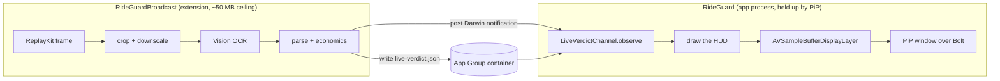

# RideGuard for iOS

Be precise about what has and has not been proven here, because the two halves
are in very different states.

**The domain is compiled and tested.** `RideGuardCore` — the parsers, the token
scanner, the profit calculator, the platform routing and the update rules —
builds clean and passes **85 tests**, run on Linux with the Swift 6.1 toolchain.
That is the half where a mistake shows up as a wrong number rather than a build
error, so it is the half worth proving first, and it is proven.

**The UI and the two extensions have never been near a compiler.** Everything
that imports SwiftUI, AVKit, Vision, ReplayKit or ActivityKit needs an SDK that
only exists on a Mac. It parses cleanly, and it has been read hard, but treat
the first Xcode build as a debugging session — see
[What to check first](#what-to-check-first).

Run [`./verify.sh`](verify.sh) first. It does the whole check in one command,
with signing switched off, so a compile error cannot hide behind a certificate
problem.

---

## What you need before this runs

| | Needed? | Why |
|---|---|---|
| **A Mac** | **Yes, mandatory** | Xcode only runs on macOS. There is no cross-compiler, no cloud shortcut worth the trouble, and no way to produce a signed `.ipa` without it. |
| **An iPhone** | **Yes, for real testing** | The Simulator can run the app and the unit tests, but it cannot test the share extension against a real screenshot taken in the Bolt app, cannot test a Live Activity properly, and cannot test OTA install at all. |
| **Apple Developer Program — €99/yr** | Yes, for anything lasting | A *free* Apple ID can sideload to your own phone, but the build **expires after 7 days** and must be reinstalled from Xcode, and it cannot do over-the-air updates at all. |

So: **a Mac is non-negotiable, an iPhone is needed for anything real.** The Mac
is the hard blocker — with a Mac and no iPhone you can still build and run the
whole app in the Simulator; with an iPhone and no Mac you can do nothing.

### The cheap way to try it

A free Apple ID gets you onto your own phone in about ten minutes, with two
catches: it dies after 7 days, and the in-app updater will not work. That is
fine for finding out whether the app is worth paying for.

### The real way

Apple Developer Program, then an **ad-hoc** distribution profile with each
target phone's UDID registered (yours and your friend's — the limit is 100
devices per year). That is what makes `itms-services://` OTA updates work, which
is the iOS half of "upload to GitHub and it updates itself".

---

## Building

**Xcode 15.3 or newer.** `Core/Live/LiveVerdict.swift` uses
`nonisolated(unsafe)`, which is Swift 5.10 syntax. `SWIFT_VERSION: "5.9"` in
`project.yml` selects the language *mode*, not the compiler, so this is a
floor on the toolchain rather than on the setting — and on Xcode 15.0–15.2 it
fails at parse time, which reads like a corrupt file rather than a version
problem.

```bash
brew install xcodegen
cd ios
./verify.sh                # domain tests, generate, unsigned build — do this first
open RideGuard.xcodeproj
```

There is deliberately no `.xcodeproj` in the repository. A `project.pbxproj` is
a generated file nobody can review and every branch conflicts on;
[`project.yml`](project.yml) is the same information in a form a diff can
explain.

Then, once, in Xcode:

1. Set **Signing & Capabilities → Team** on all **five** signable targets:
   `RideGuard`, `RideGuardBroadcast`, `RideGuardShareExtension`,
   `RideGuardWidgets` and `RideGuardCore`. Or set `DEVELOPMENT_TEAM` once in
   `project.yml` and regenerate, which is less error-prone.
2. Create the **App Group** `group.com.rideguard.shared` and enable it on the
   app *and both extensions*. Miss it anywhere and the failure is silent:
   - on **RideGuardBroadcast** it is fatal to the whole live HUD. That group is
     the only channel out of the broadcast extension, so without it the
     extension reads the screen perfectly and has no way to say what it saw.
     `LiveOfferPipeline.start()` refuses to run rather than pretend.
   - on **RideGuardShareExtension** it is worse than fatal — the extension
     falls back to a default vehicle out of its own container and answers with
     a confidently wrong number, which is the worst failure this app has.
3. Bundle IDs are `com.rideguard.app`, `.app.broadcast`, `.app.share` and
   `.app.widgets`. Change the prefix if that namespace is not yours — and if
   you do, change `preferredExtension` in
   [`BroadcastPickerButton.swift`](RideGuard/Overlay/BroadcastPickerButton.swift)
   to match, or the picker will list every screen recorder on the phone except
   this one.

The domain tests need none of the above, and no Mac either:

```bash
swift test          # RideGuardCore only — Foundation, no UIKit, ~2 seconds
```

That works on Linux too, which is where the current 85 passing tests were run.
`Core/Live/LiveVerdict.swift` guards its App Group and Darwin-notification code
behind `#if canImport(Darwin)` for exactly this reason: keeping the offer maths
checkable without a Mac is worth one conditional.

---

## What the iOS app actually is

The sandbox limit is real and has not moved: **no app may read another app's
screen, and no app may draw over another app.** There is no entitlement for
either. [`docs/ios-platform-limits.md`](../docs/ios-platform-limits.md) lists
every API that was considered and why each one fails.

What changed is that two features nobody designed for this can be combined to
land in the same place:

- **ReplayKit** hands system-wide screen frames to a *Broadcast Upload
  Extension* — the one process on iOS that sees other apps' pixels. It is not
  allowed to draw anything.
- **Picture-in-Picture** floats a window above other apps, and a PiP window is
  not required to contain video. Fed by an `AVSampleBufferDisplayLayer`, it
  will float frames we drew ourselves. It cannot see the screen.

Each is missing exactly what the other has, and they live in different
processes with no shared memory, no XPC and no `NotificationCenter` between
them. The App Group container plus a Darwin notification is the only bridge:



The order is load-bearing: the file is written first, the notification second.
A notification carries no payload and a file emits no signal, so a reader woken
before the bytes land reads the *previous* verdict — and loses an update with
nothing logged anywhere.

| | Android | iOS |
|---|---|---|
| Verdict floats over the offer card | yes, an accessibility overlay | yes, via ReplayKit + PiP — with the caveats below |
| Driver has to arm it | no, always on | **yes, one tap per shift** to start the broadcast |
| Visible while it runs | nothing | the system **recording indicator** stays lit |
| Screenshot → share → verdict | — | yes, and it needs no broadcast |
| Type the numbers → verdict | yes | yes |
| Same parser and same economics | yes | yes, same 85 tests |
| Updates itself from GitHub | yes, installs the APK | yes, via `itms-services://` (needs the paid account) |

Be clear-eyed about the cost. The broadcast must be started by the driver and
stays lit for the shift; it burns more battery than the Android build; and the
PiP trick is outside what PiP is for, so **Apple can close it in any release**.
It would also be rejected by App Store review — background audio with no audio
(2.5.4) and PiP with no media are both explicit triggers. Distribution is
TestFlight, and in the EU an alternative marketplace.

It is built anyway, because on an iPhone 11 there is no Dynamic Island and so
no glanceable Live Activity while Bolt is in the foreground. This is the only
thing that puts a number in front of the driver's eyes while the offer is still
on screen, which is the entire point of the app.

---

## What to check first

Nothing here has been near a compiler, so the first build will produce errors.
Highest-risk areas, in order:

1. **`RideGuard/Capture/`** — Vision API surface (`VNRecognizeTextRequest`,
   revision constants, `recognitionLanguages`) is the easiest thing to get
   subtly wrong from memory.
2. **`RideGuardLiveActivity/` + `RideGuardWidgets/`** — ActivityKit is strict
   about attribute types and `Info.plist` keys, and the app target needs
   `NSSupportsLiveActivities`.
3. **App Group plumbing in `Persistence.swift`** — verify the app and the
   extension genuinely see the same container, by writing in one and reading in
   the other. Do not assume.
4. **`Core/Parse/`** — mirrors the Kotlin parser. If a number comes out wrong,
   diff it against
   `android/domain/src/main/kotlin/com/rideguard/domain/parse/` rather than
   guessing; the Kotlin side has 72 passing tests and is the reference.

Run `swift test` before opening Xcode. It exercises the parser, the economics
and the update-manifest rules with no signing and no device, so it separates
"the logic is wrong" from "the project is misconfigured".
